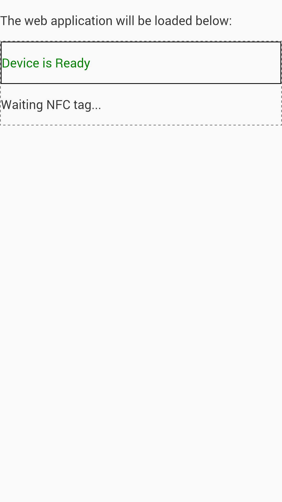
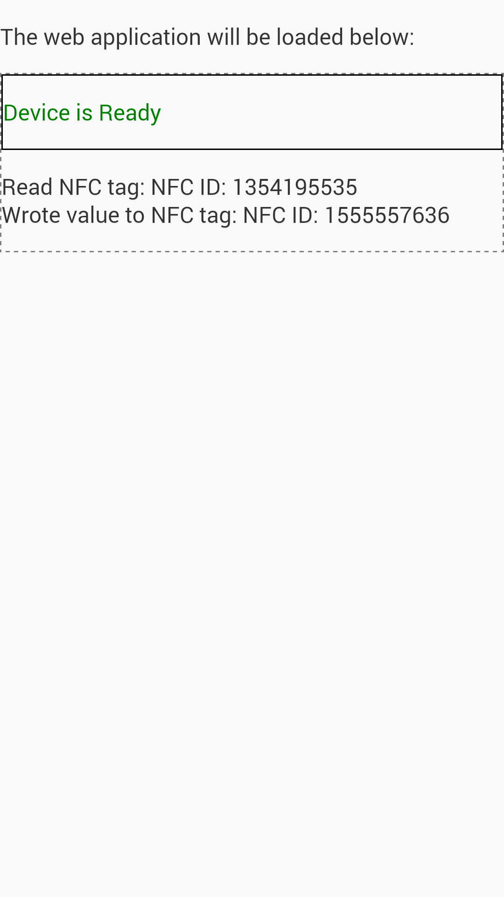

# Summary #

This is a sample PhoneGap web application demonstrating reading and writing
NFC chips with a phone.

The WTFPL license applies to all parts not specifically licensed otherwise.

The client directory contains the mobile PhoneGap client application.
The server directory contains the JavaEE server.

## Client ##

This sample project was bootstrapped by using the following commands:

```
phonegap create Web-NFC fi.neter.Web-NFC Web-NFC
mv Web-NFC client
cd client
phonegap platform add android
phonegap plugin add https://github.com/chariotsolutions/phonegap-nfc.git
```

## Server ##

The server application is a simple Spring WAR for Tomcat for serving the PhoneGap application and
for providing the backend side for receiving and sending NFC tag content.

# Requirements #

You'll also need Android SDK: http://developer.android.com/sdk/installing/index.html?pkg=tools

Install the Android SDK to /opt/android-sdk-linux, and chown it to your user:

```
sudo chown -R YOURUSER /opt/android-sdk-linux
```

Also add it to path and ANDROID_HOME:

```
export PATH=$PATH:/opt/android-sdk-linux/utils
export ANDROID_HOME=/opt/android-sdk-linux
```

Run android command and install Android SDK Build-tools version 19.

Install also the Android 4.4.2 (API 19) packages.

You'll also need ant, maven, and Tomcat:

```
sudo apt-get install ant maven tomcat7
```

You also might like SprintSource STS: http://spring.io/tools/sts/all

# Web NFC Standard #

There is a draft W3C standard for NFC for web applications: http://www.w3.org/2012/nfc/web-api

This repository contains a test page to test basic Web NFC functionality.
The test page is in: server/src/main/webapp/test-web-nfc-standard.html

It has been tested _not_ to work with Android 4.4.3,
mobile Chrome 39.0.2171.93,
mobile Firefox 34.0.

# Build #

Note that you'll need to configure the IP address to your Tomcat server currently hardcoded in the client and the server.

## Client ##

You can build the apk file in the client directory with the command:

```
phonegap build
```

The built client application will reside in: client/platforms/android/ant-build/CordovaApp-debug.apk

Copy that to your Android mobile device with NFC support and install it.

You can use adb logcat that comes with the Android SDK for debugging with your phone connected over USB:

```
adb logcat | grep Cordova
adb logcat | grep CONSOLE
```

## Server ##

Just run:

```
mvn package
```

Then copy target/Web-NFC_server-1.0.0-SNAPSHOT.war to /var/lib/tomcat7/webapps/.

# Usage #

The application reads an NFC tag, signals the content to the server, and gets
a random tag id back to write back to the tag. This is repeated as many times
as you scan the tag.

The application has been throughly tested on a HTC One, Android version 4.4.3.

Remember to change the serverAddress in both the client and the server before building and installing.
The locations for the server address are client/www/index.html and server/src/main/webapp/index.html

The installed mobile application can be found from the menu with the name Web-NFC.

Be sure to use the application with rewritable NFC tags. This application does
not set the read-only bit for the tag, but that is also possible after writing.

You can see the backend messages by tailing the Tomcat catalina.out log:

```
sudo tail -f /var/log/tomcat7/catalina.out
```

Application before any tags are scanned:



Application after an NFC tag is scanned:



# Notes #

When developing web NFC applications, you should make sure that the connection
between the client and the server is secure, and that the client cannot connect
to arbitrary web sites by using PhoneGap whitelisting or other similar security
methods and also TLS. Currently all URLs are whitelisted with a * URL pattern.
Otherwise an arbitrary man-in-the-middle can read and
write your NFC chips (remotely) and possibly cause trouble.

For large projects you might want to switch to TypeScript and for example angular.js.
Communications between the client and the server can be done bidirectionally with socket.io for example.
